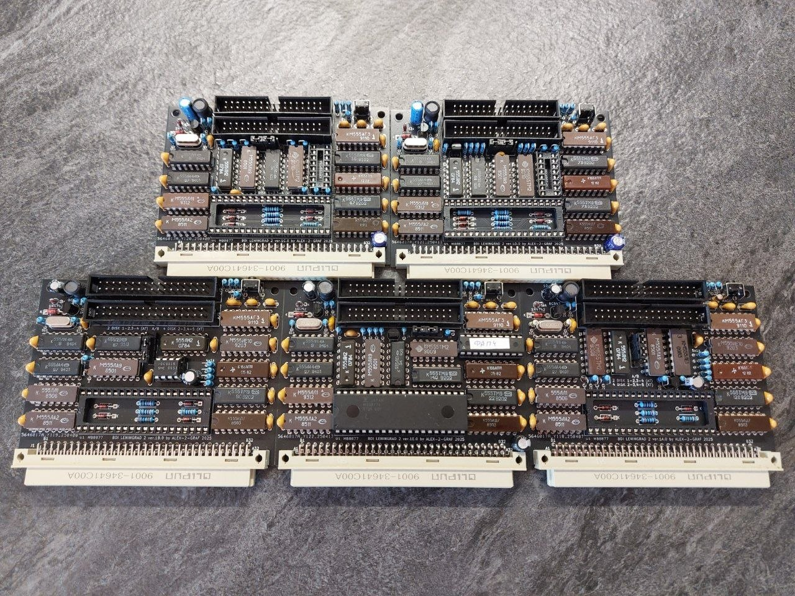

# Leningrad2-BDI-TR-DOS

## Beta Disk Interface (TR-DOS) controller for Leningrad-2 (Custom Edition). 5 versions of Read Channel (PLL).

> [English](README.en.md) | [Русский](README.md)

The "Leningrad-2" (designed by Sergey Zonov, 1989) became one of the most widespread and successful ZX Spectrum clones in the USSR and CIS countries. It was highly valued for its compactness and relatively simple assembly. However, out of the box, the computer only supported cassette tape recorders.

The Beta Disk Interface (BDI), originally created by the British company Technology Research Ltd, revolutionized the Soviet ZX Spectrum scene. Thanks to the availability of the KR1818VG93 (КР1818ВГ93) floppy disk controller chip (a direct clone of the Western Digital WD1793), the TR-DOS system became the de facto standard. It transformed the home computer into a serious machine capable of instant game and system software loading.

This project is an attempt to merge the aesthetics of the classic "Leningrad-2" with the reliability of modern printed circuit boards, preserving the true spirit of the golden era of 8-bit computing.

***

## Read Channel (PLL) Versions

The Phase-Locked Loop (PLL / ФАПЧ) is the most critical and sensitive part of any Spectrum floppy controller. The quality of data and clock pulse separation determines whether the drive can reliably read old, worn-out floppy disks or modern 3.5" disk drives.

*   **ver.1A.1** — *Classic discrete logic circuit.*
    ([iBOM](Export/A/BDI%20Leningrad-2%201A-1.html) / [Schematics](Export/A/BDI%20Leningrad-2%201A-1.pdf) / [Gerber](Gerber/A/BDI_L2_1A_1_Gerber.zip))
*   **ver.1B.1** — *Variant utilizing a dedicated FDC9216B Data Separator chip.*
    ([iBOM](Export/B/BDI%20Leningrad-2%201B-1%20(FDC9216B).html) / [Schematics](Export/B/BDI%20Leningrad-2%201B-1%20(FDC9216B).pdf) / [Gerber](Gerber/B/BDI_L2_1B_1_Gerber.zip))
*   **ver.1C.1** — *Variant featuring a PLL based on the RT4A / КР556РТ4А PROM (C48).*
    ([iBOM](Export/C/BDI%20Leningrad-2%201C-1%20(%D0%A0%D0%A24%D0%90)(C48).html) / [Schematics](Export/C/BDI%20Leningrad-2%201C-1%20(%D0%A0%D0%A24%D0%90)(C48).pdf) / [Gerber](Gerber/C/BDI_L2_1C_1_Gerber.zip) / [РТ4А](Export/C/556RT4.bin))
*   **ver.1D.1** — *Variant featuring a PLL based on the RT4A / КР556РТ4А PROM (HIMAK).*
    ([iBOM](Export/D/BDI%20Leningrad-2%201D-1%20(%D0%A0%D0%A24%D0%90)(HIMAK).html) / [Schematics](Export/D/BDI%20Leningrad-2%201D-1%20(%D0%A0%D0%A24%D0%90)(HIMAK).pdf) / [Gerber](Gerber/D/BDI_L2_1D_1_Gerber.zip) / [РТ4А](Export/D/556PT4A.bin))
*   **ver.1E.1** — *Variant featuring a PLL based on the GAL16V8B PLD (Scorpion layout).*
    ([iBOM](Export/E/BDI%20Leningrad-2%201E-1(GAL16V8B).html) / [Schematics](Export/E/BDI%20Leningrad-2%201E-1(GAL16V8B).pdf) / [Gerber](Gerber/E/BDI_L2_1E_1_Gerber.zip) / [GAL16V8B](Export/E/fapch.jed))

⚠️ **Important Note on Version Selection:** 
Differences in the PLL implementation are only critical if you intend to use real, physical magnetic floppy disk drives (5.25" or 3.5"). If you plan to use a hardware floppy drive emulator (such as a Gotek drive running FlashFloppy firmware), a complex analogue PLL circuit is not required. Emulators output a perfectly stable, clean digital signal that is easily processed by any of the versions above, including the simplest one (**Classic ver.1A.1**). In this case, you can choose the board that is easiest for you to source and assemble.

***

## Form Factor & Standardization

All 5 board versions share identical physical dimensions and mounting hole locations. This design choice allows you to swap one controller revision for another seamlessly within the same computer chassis.
  
  
  
## Technical Specifications & Integration

These controllers are designed for seamless, **Plug-and-Play** connection to my customized motherboard projects:
* [Leningrad-2-48k](https://github.com/Alex-2-Graf/LENINGRAD-2-48k)  
* [Leningrad-2-128k-SRAM](https://github.com/Alex-2-Graf/Leningrad-2-128k-SRAM)  

On the motherboards mentioned above, the system bus and control signals are already pre-routed and fully prepared. 

To connect these controllers to any other third-party or stock version of the Leningrad-2 computer, a minor modification will be required (detailed in the schematics). This primarily involves verifying the presence of core bus signals and manually routing the `+BETA` and `-BETA` control signals.

*Note: It is also possible to use a modern hardware WD1793/ВГ93 chip emulator instead of the original IC.*
[VG93-MB8877](https://github.com/Alex-2-Graf/VG93-MB8877-lgt8f328p-emulator)

With fully functional components and proper soldering, the board requires no complex tuning or oscilloscope calibration.

***

## Recommended TR-DOS ROM Firmware

*   **TR-DOS 5.03:** The original, highly stable version. Perfect for maximum compatibility with classic software and games.
*   **TR-DOS 5.04T (Turbo):** A modified version featuring accelerated read/write routines. Highly recommended for everyday hardware use.
