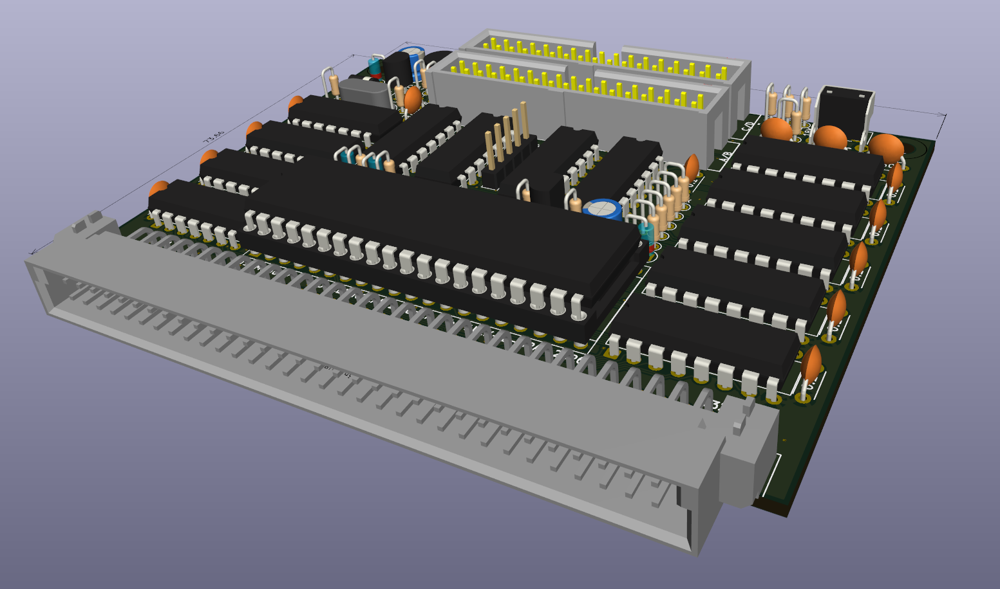
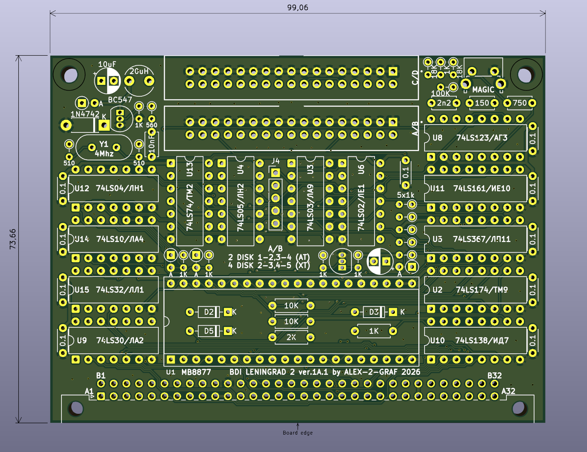
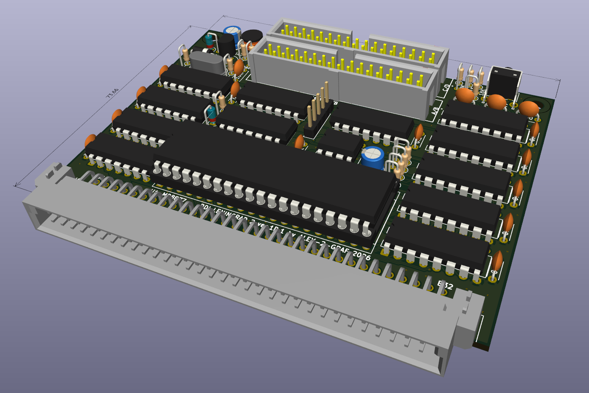
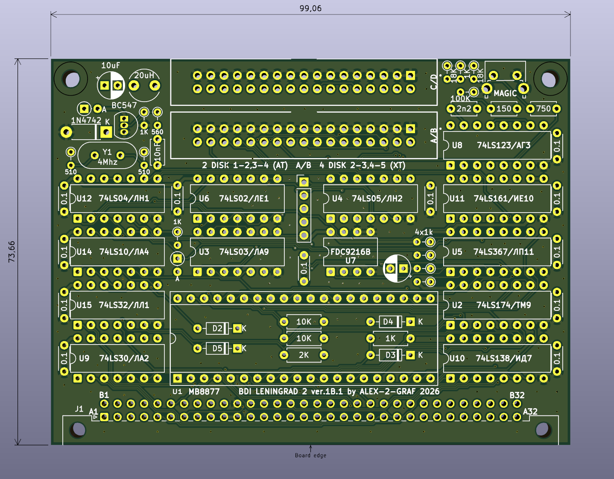
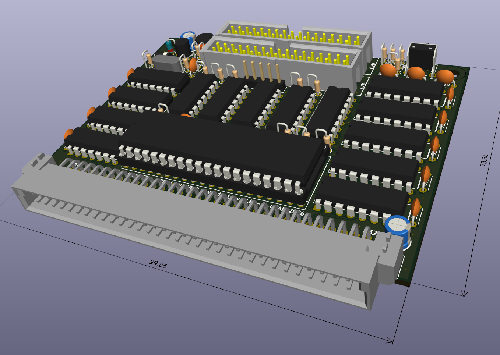
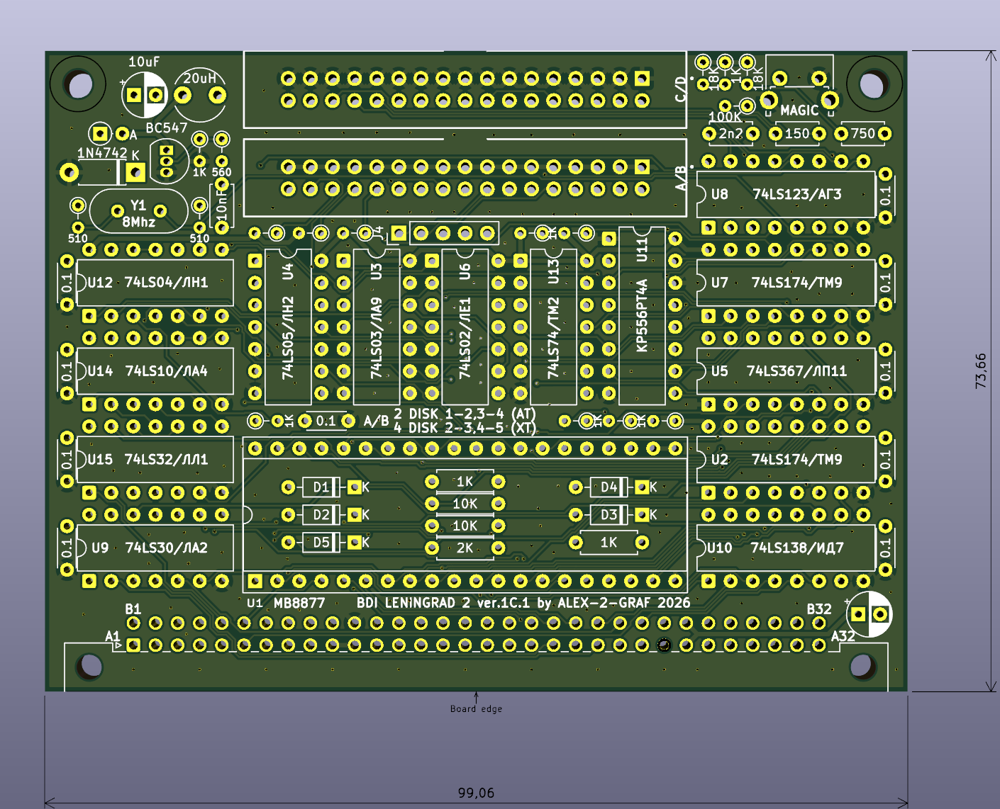
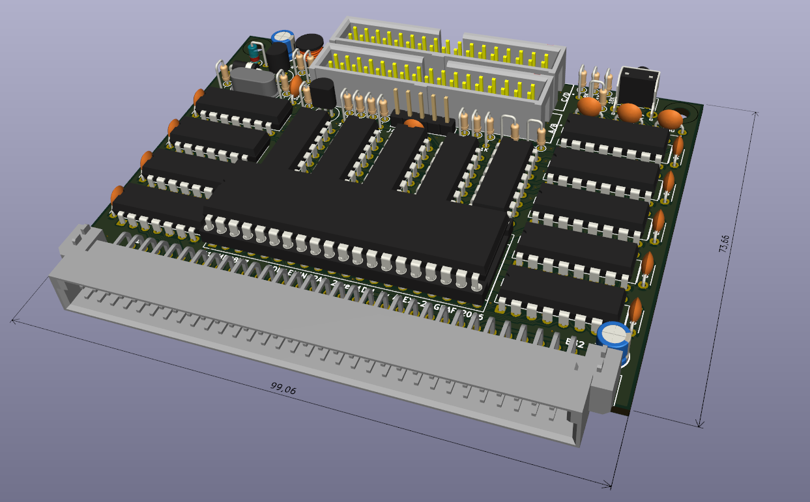
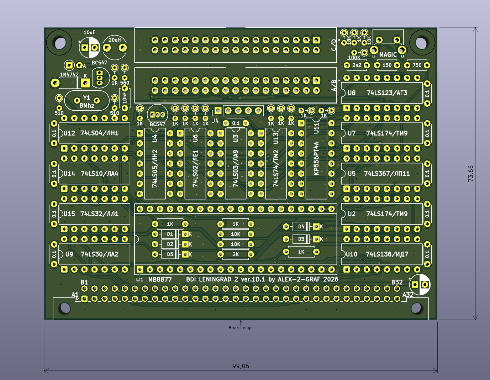
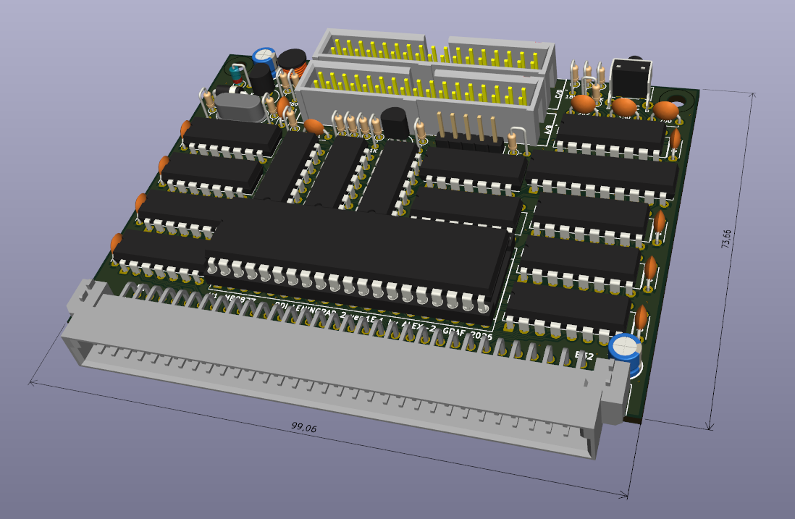
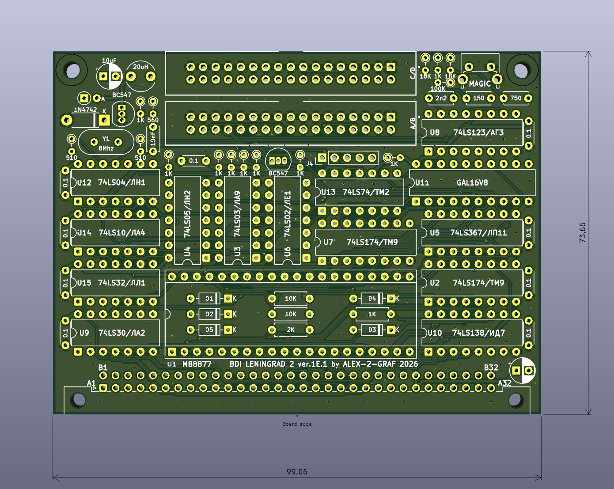

# Leningrad2-BDI-TR-DOS

## Beta Disk Interface (TR-DOS) controller for Leningrad-2 (Custom Edition). 5 versions of Read Channel (PLL)

Leningrad-2 (разработка Сергея Зонова, 1989 г.) стал одним из самых массовых  
и удачных клонов ZX Spectrum в СССР и СНГ.  
Его ценили за компактность и относительную простоту сборки,  
однако «из коробки» компьютер работал только с магнитофонными кассетами.  
  
Beta Disk Interface (BDI), созданный британской компанией Technology Research Ltd,  
совершил революцию в отечественном спектрумизме.  
Благодаря доступности микросхемы контроллера накопителя на гибких магнитных дисках (КНГМД) КР1818ВГ93  
(аналог Western Digital WD1793), система TR-DOS стала стандартом де-факто.  
Она превратила домашний компьютер в серьезную машину с мгновенной загрузкой игр и системного софта.  
  
Данный проект — это попытка объединить эстетику классического «Ленинграда-2»  
с надежностью современных печатных плат, сохранив дух золотой эры 8-битных вычислений.  
  
## Описание вариантов (Versions)
  
ФАПЧ — самое «узкое» место в контроллерах дисковода для Спектрума.  
Именно от качества разделения данных и синхроимпульсов зависит, будет ли  
дисковод читать старые «запиленные» дискеты или современные 3.5" приводы.

ver.1A.1 — Классическая схема на дискретной логике.  
  
[iBOM](Export/A/BDI%20Leningrad-2%201A-1.html) [Схема](Export/A/BDI%20Leningrad-2%201A-1.pdf) [Gerber](Gerber/A/BDI_L2_1A_1_Gerber.zip)
  

  

  
ver.1B.1 — Вариант с Data Separator на FDC9216B.  
    
[iBOM](Export/B/BDI%20Leningrad-2%201B-1%20(FDC9216B).html) [Схема](Export/B/BDI%20Leningrad-2%201B-1%20(FDC9216B).pdf) [Gerber](Gerber/B/BDI_L2_1B_1_Gerber.zip)
  

  

  
ver.1C.1 — Вариант с ФАПЧ на РТ4А (С48).  
    
[iBOM](Export/C/BDI%20Leningrad-2%201C-1%20(%D0%A0%D0%A24%D0%90)(C48).html) [Схема](Export/C/BDI%20Leningrad-2%201C-1%20(%D0%A0%D0%A24%D0%90)(C48).pdf) [Gerber](Gerber/C/BDI_L2_1C_1_Gerber.zip) [РТ4А](Export/C/556RT4.bin)
  

  
ver.1D.1 — Вариант с ФАПЧ на РТ4А (HIMAK).  
   
[iBOM](Export/D/BDI%20Leningrad-2%201D-1%20(%D0%A0%D0%A24%D0%90)(HIMAK).html) [Схема](Export/D/BDI%20Leningrad-2%201D-1%20(%D0%A0%D0%A24%D0%90)(HIMAK).pdf) [Gerber](Gerber/D/BDI_L2_1D_1_Gerber.zip) [РТ4А](Export/D/556PT4A.bin)
  

  

  
ver.1E.1 — Вариант с ФАПЧ на GAL16V8B (Scorpion).  
  
[iBOM](Export/E/BDI%20Leningrad-2%201E-1(GAL16V8B).html) [Схема](Export/E/BDI%20Leningrad-2%201E-1(GAL16V8B).pdf) [Gerber](Gerber/E/BDI_L2_1E_1_Gerber.zip) [GAL16V8B](Export/E/fapch.jed)
  

  

  
    ⚠️ Важное замечание по выбору версии:
    Различия в реализации ФАПЧ (PLL) критичны только при использовании  
    реальных магнитных дисководов (5.25" или 3.5").  
    Если вы планируете использовать эмулятор дисковода  
    (например, Gotek с прошивкой FlashFloppy), сложная схема ФАПЧ не требуется.  
    Эмуляторы выдают стабильный цифровой сигнал, который отлично подхватывается  
    любой из представленных версий, включая самую простую (Classic ver.1A.1).  
    В этом случае вы можете выбирать наиболее простую в сборке плату.

## Унификация  
  
Все 5 версий плат имеют идентичные габаритные размеры и расположение крепежных отверстий.  
Это позволяет легко заменять одну ревизию контроллера на другую в рамках одного корпуса.  
  

## Техническое примечание:  
  
Контроллеры разработаны для бесшовного (Plug-and-Play) подключения к моим версиям плат:
  
* [Leningrad-2-48k](https://github.com/Alex-2-Graf/LENINGRAD-2-48k)  
* [Leningrad-2-128k-SRAM](https://github.com/Alex-2-Graf/Leningrad-2-128k-SRAM)  
  
На этих платах системная шина и сигналы управления уже подготовлены.  
Для подключения к любым другим версиям Leningrad-2 потребуется минимальная  
доработка (указана на схемах), которая сводится к проверке наличия основных сигналов  
и заведению сигналов +BETA и -BETA.

В качестве контролера возможно использование [эмулятора ВГ93](https://github.com/Alex-2-Graf/VG93-MB8877-lgt8f328p-emulator)
  
При использовании исправных компонентов и качественной пайки настройка не требуется.  
  
## Рекомендуемые прошивки ПЗУ (ROM)  
  
* TR-DOS 5.03: Оригинальная стабильная версия. Идеальна для максимальной совместимости с классическим софтом.  
* TR-DOS 5.04T (Turbo): Модифицированная версия с ускоренными процедурами чтения/записи. Рекомендуется для повседневного использования.  
